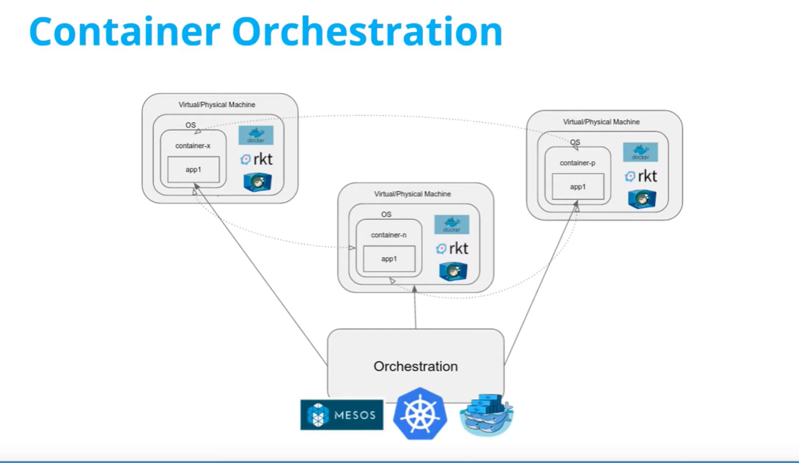
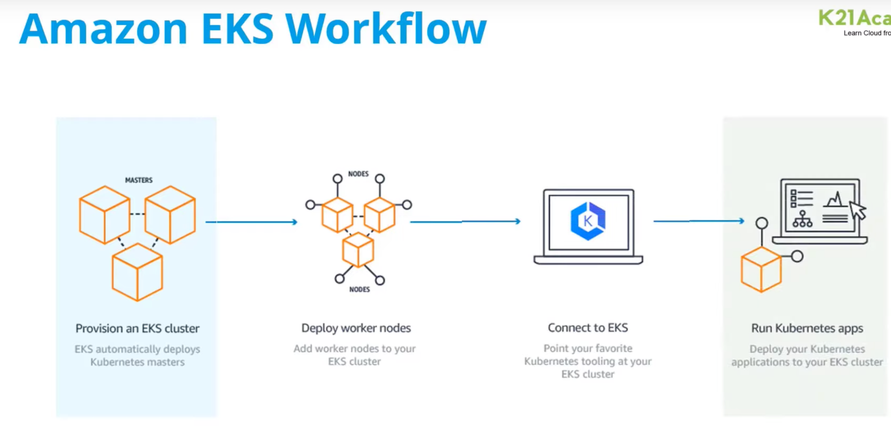

### (Amazon EKS)
* **Kubernetes is container orchestration and Management tool**

Amazon Elastic Kubernetes Service (Amazon EKS) is a fully managed Kubernetes service provided by Amazon Web Services (AWS).
It simplifies the process of running Kubernetes on AWS by removing the need for users to install,
operate, and maintain their own Kubernetes control plane. With Amazon EKS, users can easily create and manage Kubernetes clusters,
which are made up of a group of worker nodes that run containerized applications.
Amazon EKS provides a highly available and scalable Kubernetes control plane that is integrated with other AWS services,
such as Elastic Load Balancing, Auto Scaling, and Identity and Access Management (IAM).



### VPC
* Virtual private cloud (network)

### Subnet
* Virtual Private Cloud (VPC) networks are global resources. Each VPC network consists of one or more IP address ranges called subnets. 
Subnets are regional resources.

Great question 👍 Let’s break it down step by step so you get a **complete picture of AWS EKS (Elastic Kubernetes Service)**, its components, and how to work with it using **Terraform**.

---

# 🔹 1. What is AWS EKS?

**Amazon Elastic Kubernetes Service (EKS)** is a **managed Kubernetes service** on AWS.

* You get a fully managed **control plane** (no need to install Kubernetes master nodes).
* You manage and scale your **worker nodes (EC2, Fargate, or Bottlerocket)**.
* It integrates deeply with AWS (IAM, VPC, Load Balancers, CloudWatch, etc.).

👉 In short: EKS = Kubernetes + AWS-managed control plane.

---

# 🔹 2. Key Components of EKS

### ✅ 1. **Control Plane (Managed by AWS)**

* Kubernetes **API server**
* **etcd** (stores cluster state)
* Controller manager, scheduler
* AWS runs this in HA across 3 AZs

### ✅ 2. **Worker Nodes (Your Responsibility)**

* EC2 instances or AWS Fargate pods that run workloads.
* Join the cluster via `aws-auth` ConfigMap.

### ✅ 3. **Networking**

* Uses **Amazon VPC CNI plugin**: Each pod gets an **ENI (Elastic Network Interface)** + private IP.
* Supports **Load Balancers**:

    * **CLB/NLB** → TCP/UDP apps
    * **ALB (Ingress)** → HTTP apps

### ✅ 4. **IAM Integration**

* **IAM Roles for Service Accounts (IRSA)**: Map K8s service accounts → IAM roles.
* Fine-grained AWS permissions inside pods.

### ✅ 5. **Storage**

* **EBS CSI driver** → Block storage for Pods.
* **EFS CSI driver** → Shared storage across Pods.
* **S3** for object storage integration.

### ✅ 6. **Observability**

* **CloudWatch Logs** → Cluster logs.
* **Prometheus/Grafana** → Metrics & dashboards.

---

# 🔹 3. How EKS Works (High-Level Flow)

1. **Create an EKS cluster** (control plane runs in AWS-managed VPC).
2. **Launch worker nodes** (EC2 or Fargate).
3. Worker nodes authenticate to the control plane via **IAM & aws-auth ConfigMap**.
4. Deploy workloads (`kubectl apply`).
5. **Load balancers & networking** handled via AWS integrations (Ingress Controller, VPC CNI).
6. Monitoring/logging integrated with CloudWatch or Prometheus.

---

# 🔹 4. Provisioning EKS with Terraform

Terraform automates cluster + VPC + node group creation.

### **Step 1: Install Terraform & AWS CLI**

```bash
terraform -version
aws configure
```

---

### **Step 2: Terraform Modules**

We use the **official AWS EKS module**:
👉 [terraform-aws-eks](https://github.com/terraform-aws-modules/terraform-aws-eks)

---

### **Step 3: Example Terraform Code**

```hcl
# providers.tf
provider "aws" {
  region = "us-east-1"
}

# vpc.tf - Create VPC for EKS
module "vpc" {
  source  = "terraform-aws-modules/vpc/aws"
  version = "5.0.0"

  name = "eks-vpc"
  cidr = "10.0.0.0/16"

  azs             = ["us-east-1a", "us-east-1b", "us-east-1c"]
  private_subnets = ["10.0.1.0/24", "10.0.2.0/24", "10.0.3.0/24"]
  public_subnets  = ["10.0.4.0/24", "10.0.5.0/24", "10.0.6.0/24"]

  enable_nat_gateway = true
  single_nat_gateway = true
}

# eks-cluster.tf - Create EKS Cluster
module "eks" {
  source          = "terraform-aws-modules/eks/aws"
  cluster_name    = "my-eks-cluster"
  cluster_version = "1.29"

  vpc_id     = module.vpc.vpc_id
  subnet_ids = module.vpc.private_subnets

  eks_managed_node_groups = {
    worker_group = {
      desired_size = 2
      max_size     = 4
      min_size     = 1

      instance_types = ["t3.medium"]
    }
  }
}
```

---

### **Step 4: Deploy**

```bash
terraform init
terraform apply -auto-approve
```

Terraform creates:

* VPC (public + private subnets)
* EKS cluster (control plane managed by AWS)
* Node Group (EC2 workers)

---

### **Step 5: Configure kubectl**

```bash
aws eks update-kubeconfig --region us-east-1 --name my-eks-cluster
kubectl get nodes
```

👉 You should see worker nodes registered.

---

# 🔹 5. Typical Workload Flow on EKS

1. **Developer** pushes code → CI/CD builds Docker image → pushes to **ECR**.
2. Deploy via `kubectl` or ArgoCD → EKS pulls image from **ECR**.
3. Pods scheduled → get IPs via **VPC CNI**.
4. Services exposed via **ALB/NLB**.
5. Metrics collected by **Prometheus/Grafana** or **CloudWatch**.

---

# 🔹 6. Advantages of EKS

* No need to manage K8s control plane.
* Seamless AWS integrations (IAM, VPC, CloudWatch).
* Runs **vanilla Kubernetes** → portable workloads.
* Supports EC2, Fargate, and hybrid.

---

✅ **Summary:**

* **EKS = Managed Kubernetes on AWS** (AWS runs the masters, you manage workers).
* **Components:** Control plane, worker nodes, VPC CNI, IAM, Storage, Observability.
* **Terraform Workflow:** VPC → EKS Cluster → Node Groups → Deploy workloads.

---

Would you like me to also give you a **full Terraform + Helm example** (where Terraform not only provisions EKS but also installs tools like **ALB Ingress Controller, Prometheus, and Grafana** automatically)? That’s what most production EKS setups look like.
