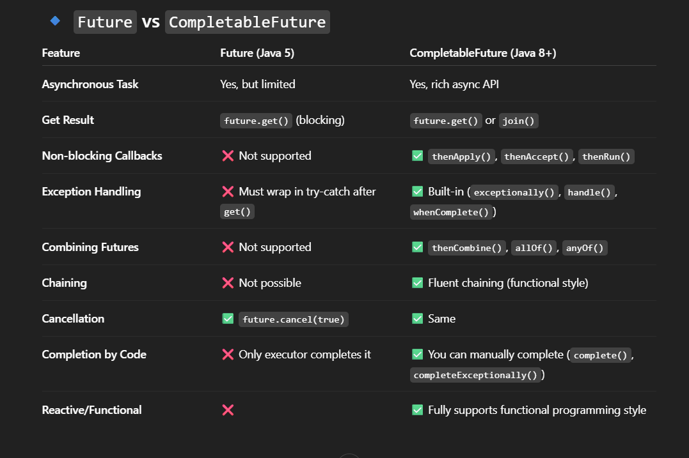

### Ways to Handle Exceptions in CompletableFuture
* Use **exceptionally()** → if you just want a fallback.
* Use **handle()** → if you want to handle both success & failure.
[CompletableFutureExceptionHandling.java](../src/main/java/com/prep/interview/multiThreading/completableFuture/CompletableFutureExceptionHandling.java)

### Difference between Future and CompletableFuture?
- a CompletableFuture is an extension of Future that allows for more advanced composition and chaining of asynchronous computations.
