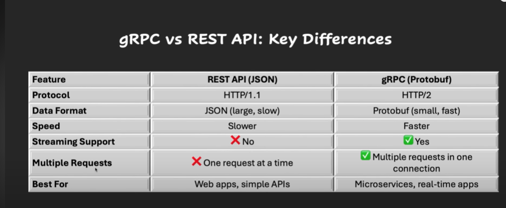

# gRPC (google Remote Procedure Call) is a high-performance, open-source RPC framework developed by Google.

## Communication Types
1) Unary RPC – Single request → single response.
2) Server streaming – Single request → multiple responses.
3) Client streaming – Multiple requests → single response.
4) Bidirectional streaming – Both sides send multiple messages simultaneously.

