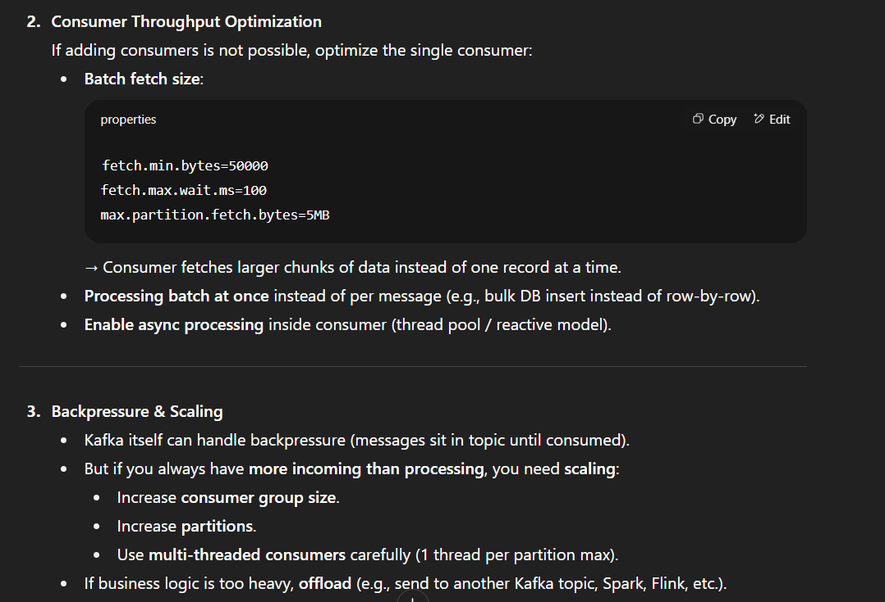
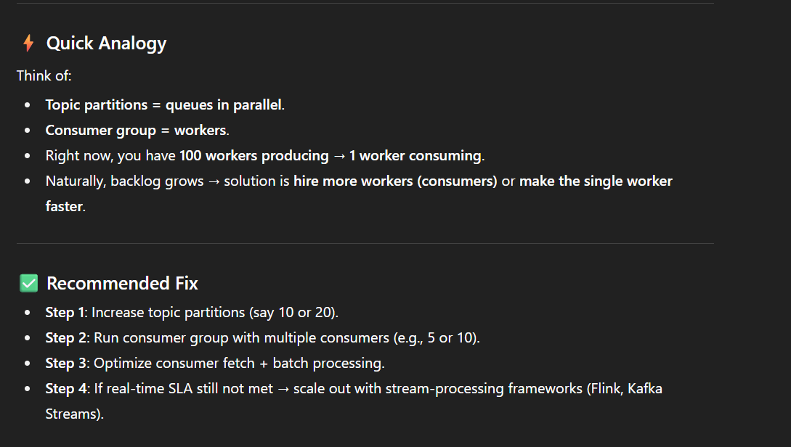

-[Kafka Note.pdf](/data-structure-algorithms/src/main/java/com/hemant/interview/theory/pdf)

**Q What is Apache Kafka?**
Apache Kafka is a distributed event streaming platform used for high-throughput,
low-latency data streaming between systems.
-> Key Points
* Pub/Sub model → Producers publish messages to topics, Consumers subscribe to those topics.
* Highly scalable → Handles millions of events/sec.
* Fault-tolerant → Data replicated across multiple brokers.
-> Use cases:
* Real-time analytics (e.g., tracking website clicks)
* Microservices communication
* Log aggregation
* Event sourcing
1. Topic
   A category or feed name where records are stored and published.
   Topics are split into partitions.
2. Partition
A subset of a topic — messages are spread across partitions for scalability.
Each partition is ordered, but the topic overall is not strictly ordered.
Partitions allow parallel processing.
3. Offset
A sequence ID for each record in a partition.
Acts like a bookmark so consumers know where they left off. 
4. Producer
An application that publishes (writes) messages to a Kafka topic.
Example: A payment service producing a "payment-events" message.
5. Consumer
An application that reads messages from Kafka topics.
Example: An analytics service consuming "click-events".
6. Consumer Group
A group of consumers working together to consume a topic’s partitions.
Load balancing: Each partition is consumed by only one consumer in the group.
If a consumer dies, another consumer in the group takes over.
7. Broker

A Kafka server that stores topics and partitions, and serves producer/consumer requests.

A Kafka cluster is made of multiple brokers.

8. Cluster

A set of Kafka brokers working together.

Example: A production Kafka cluster might have 3–5 brokers.

9. Leader & Follower

Leader: Handles all reads/writes for a partition.

Follower: Replicates the leader’s data for fault tolerance.

10. Replication Factor

The number of copies of a partition across brokers.

Ensures high availability and fault tolerance.

11. ZooKeeper (Legacy, being replaced by KRaft)

Manages Kafka cluster metadata, leader election, and configuration.

In newer Kafka versions, KRaft mode replaces ZooKeeper.

12. Retention Policy

Decides how long Kafka keeps messages before deletion.

Can be time-based (e.g., 7 days) or size-based (e.g., 1GB per partition).

13. Log

A sequence of records stored in a partition.

Append-only, ordered, and immutable.

14. Producer Acknowledgments (acks)

Controls how many brokers must acknowledge before a message is considered "sent":

acks=0 → Don’t wait for acknowledgment.

acks=1 → Wait for leader acknowledgment.

acks=all → Wait for all replicas acknowledgment.

15. KRaft (Kafka Raft Metadata Mode)

A new way to manage Kafka metadata without ZooKeeper.

Introduced to simplify architecture.

- **Q Mention what is the benefits of Apache Kafka over the traditional technique?**
Fast: A single Kafka broker can serve thousands of clients by handling megabytes of reads and writes per second
Scalable: Data are partitioned and streamlined over a cluster of machines to enable larger data
Durable: Messages are persistent and is replicated within the cluster to prevent data loss
Distributed by Design: It provides fault tolerance guarantees and durability
-  **Data transaction supported by kafka**
   Real-world → You typically use serializers/deserializers for String, JSON, Avro, Protobuf, custom objects.

### Problem Breakdown
100 Producers → 1 Consumer
- Producers are producing data very fast.
- Single consumer is slow → messages are piling up in Kafka → consumer lag increases → high latency.
- Kafka is horizontally scalable, but if you consume with only 1 consumer, you’re not leveraging parallelism.

- ✅ Kafka Concepts to Address This

- **Partitions & Parallelism**
- A Kafka topic is divided into partitions.
- Each consumer in a consumer group can read from different partitions in parallel.
- If you have only 1 consumer, it can only consume partitions assigned to it sequentially.
- Solution → Increase partitions and add more consumers in the group.
- 🔹 Example:
- Topic: orders with 10 partitions.
- Consumer group: order-processing-group with 5 consumers.
- Kafka will assign partitions across consumers → they work in parallel → higher throughput.

