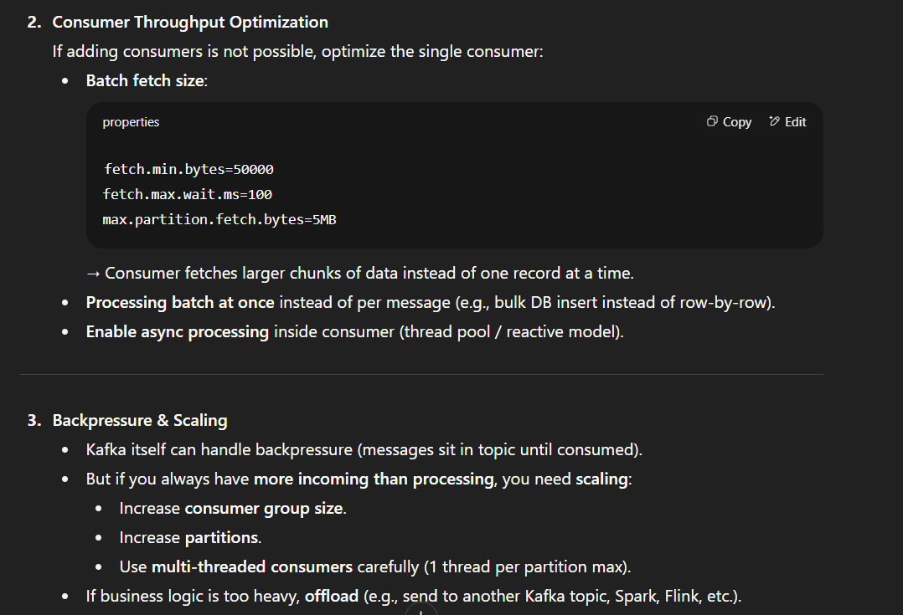
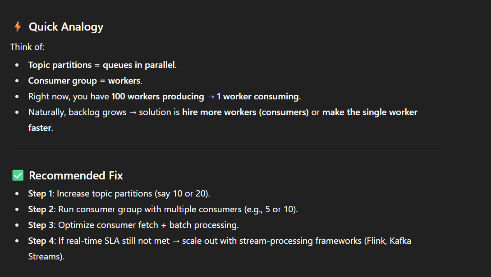

-[Kafka Note.pdf](/data-structure-algorithms/src/main/java/com/hemant/interview/theory/pdf)

**Q What is Apache Kafka?**
Apache Kafka is a distributed event streaming platform used for high-throughput,
low-latency data streaming between systems.
-> Key Points
* Pub/Sub model → Producers publish messages to topics, Consumers subscribe to those topics.
* Highly scalable → Handles millions of events/sec.
* Fault-tolerant → Data replicated across multiple brokers.
-> Use cases:
* Real-time analytics (e.g., tracking website clicks)
* Microservices communication
* Log aggregation
* Event sourcing
1. Topic
   A category or feed name where records are stored and published.
   Topics are split into partitions.
2. Partition
A subset of a topic — messages are spread across partitions for scalability.
Each partition is ordered, but the topic overall is not strictly ordered.
Partitions allow parallel processing.
3. Offset
A sequence ID for each record in a partition.
Acts like a bookmark so consumers know where they left off. 
4. Producer
An application that publishes (writes) messages to a Kafka topic.
Example: A payment service producing a "payment-events" message.
5. Consumer
An application that reads messages from Kafka topics.
Example: An analytics service consuming "click-events".
6. Consumer Group
A group of consumers working together to consume a topic’s partitions.
Load balancing: Each partition is consumed by only one consumer in the group.
If a consumer dies, another consumer in the group takes over.
7. Broker

A Kafka server that stores topics and partitions, and serves producer/consumer requests.

A Kafka cluster is made of multiple brokers.

8. Cluster

A set of Kafka brokers working together.

Example: A production Kafka cluster might have 3–5 brokers.

9. Leader & Follower

Leader: Handles all reads/writes for a partition.

Follower: Replicates the leader’s data for fault tolerance.

10. Replication Factor

The number of copies of a partition across brokers.

Ensures high availability and fault tolerance.

11. ZooKeeper (Legacy, being replaced by KRaft)

Manages Kafka cluster metadata, leader election, and configuration.

In newer Kafka versions, KRaft mode replaces ZooKeeper.

12. Retention Policy

Decides how long Kafka keeps messages before deletion.

Can be time-based (e.g., 7 days) or size-based (e.g., 1GB per partition).

13. Log

A sequence of records stored in a partition.

Append-only, ordered, and immutable.

14. Producer Acknowledgments (acks)

Controls how many brokers must acknowledge before a message is considered "sent":

acks=0 → Don’t wait for acknowledgment.

acks=1 → Wait for leader acknowledgment.

acks=all → Wait for all replicas acknowledgment.

15. KRaft (Kafka Raft Metadata Mode)

A new way to manage Kafka metadata without ZooKeeper.

Introduced to simplify architecture.


- **Q Mention what is the benefits of Apache Kafka over the traditional technique?**
Fast: A single Kafka broker can serve thousands of clients by handling megabytes of reads and writes per second
Scalable: Data are partitioned and streamlined over a cluster of machines to enable larger data
Durable: Messages are persistent and is replicated within the cluster to prevent data loss
Distributed by Design: It provides fault tolerance guarantees and durability
-  **Data transaction supported by kafka**
   Real-world → You typically use serializers/deserializers for String, JSON, Avro, Protobuf, custom objects.

### Problem Breakdown
100 Producers → 1 Consumer
- Producers are producing data very fast.
- Single consumer is slow → messages are piling up in Kafka → consumer lag increases → high latency.
- Kafka is horizontally scalable, but if you consume with only 1 consumer, you’re not leveraging parallelism.

- ✅ Kafka Concepts to Address This

- **Partitions & Parallelism**
- A Kafka topic is divided into partitions.
- Each consumer in a consumer group can read from different partitions in parallel.
- If you have only 1 consumer, it can only consume partitions assigned to it sequentially.
- Solution → Increase partitions and add more consumers in the group.
- 🔹 Example:
- Topic: orders with 10 partitions.
- Consumer group: order-processing-group with 5 consumers.
- Kafka will assign partitions across consumers → they work in parallel → higher throughput.



### Idempotence
- Making Kafka idempotent means ensuring that a message is processed exactly once (no duplicates, no missed events), 
even if retries or failures occur.
  Perfect 👌 since you’re on **Kafka > 2.9** (which supports **idempotent producers and transactions out-of-the-box**), let’s do a **Spring Boot example** that ensures **exactly-once processing**.

We’ll cover:

1. Producer config (**idempotent + transactional**)
2. Consumer config (**read\_committed**)
3. Spring Boot Kafka template usage

---

## 1. **Producer Config (Spring Boot)**

In `application.yml`:

```yaml
spring:
  kafka:
    bootstrap-servers: localhost:9092

    producer:
      acks: all
      retries: 2147483647
      enable-idempotence: true
      max-in-flight-requests-per-connection: 5
      key-serializer: org.apache.kafka.common.serialization.StringSerializer
      value-serializer: org.apache.kafka.common.serialization.StringSerializer
      properties:
        transactional.id: tx-producer-1  # required for transactions

    consumer:
      group-id: my-consumer-group
      enable-auto-commit: false
      isolation-level: read_committed   # ignores aborted transactions
      key-deserializer: org.apache.kafka.common.serialization.StringDeserializer
      value-deserializer: org.apache.kafka.common.serialization.StringDeserializer
```

---

## 2. **Transactional Producer (Java)**

```java
import org.springframework.kafka.core.KafkaTemplate;
import org.springframework.stereotype.Service;
import org.springframework.transaction.annotation.Transactional;

@Service
public class OrderProducer {

    private final KafkaTemplate<String, String> kafkaTemplate;

    public OrderProducer(KafkaTemplate<String, String> kafkaTemplate) {
        this.kafkaTemplate = kafkaTemplate;
    }

    @Transactional("kafkaTransactionManager")
    public void sendOrder(String orderId, String payload) {
        kafkaTemplate.executeInTransaction(operations -> {
            operations.send("orders", orderId, payload);
            operations.send("audit-log", orderId, "AUDIT_" + payload);
            return true;
        });
    }
}
```

👉 Here, if **any send fails**, the transaction is **aborted** and consumers won’t see partial results.

---

## 3. **Consumer (Exactly-Once with Deduplication)**

```java
import org.apache.kafka.clients.consumer.ConsumerRecord;
import org.springframework.kafka.annotation.KafkaListener;
import org.springframework.stereotype.Service;

@Service
public class OrderConsumer {

    @KafkaListener(topics = "orders", groupId = "order-service")
    public void consume(ConsumerRecord<String, String> record) {
        String orderId = record.key();
        String payload = record.value();

        // Example: Idempotent processing using UPSERT
        System.out.println("Processing order: " + orderId + " -> " + payload);

        // e.g., write to DB with UPSERT by orderId (ensures no duplicates)
    }
}
```

---

## 4. **Enable Kafka Transactions in Spring**

Add to your config class:

```java
import org.apache.kafka.clients.producer.ProducerConfig;
import org.apache.kafka.common.serialization.StringSerializer;
import org.springframework.context.annotation.Bean;
import org.springframework.context.annotation.Configuration;
import org.springframework.kafka.core.*;
import org.springframework.kafka.transaction.KafkaTransactionManager;

import java.util.HashMap;
import java.util.Map;

@Configuration
public class KafkaConfig {

    @Bean
    public ProducerFactory<String, String> producerFactory() {
        Map<String, Object> config = new HashMap<>();
        config.put(ProducerConfig.BOOTSTRAP_SERVERS_CONFIG, "localhost:9092");
        config.put(ProducerConfig.KEY_SERIALIZER_CLASS_CONFIG, StringSerializer.class);
        config.put(ProducerConfig.VALUE_SERIALIZER_CLASS_CONFIG, StringSerializer.class);
        config.put(ProducerConfig.ENABLE_IDEMPOTENCE_CONFIG, true);
        config.put(ProducerConfig.ACKS_CONFIG, "all");
        config.put(ProducerConfig.RETRIES_CONFIG, Integer.MAX_VALUE);
        config.put(ProducerConfig.MAX_IN_FLIGHT_REQUESTS_PER_CONNECTION, 5);
        config.put(ProducerConfig.TRANSACTIONAL_ID_CONFIG, "tx-producer-1");
        return new DefaultKafkaProducerFactory<>(config);
    }

    @Bean
    public KafkaTemplate<String, String> kafkaTemplate() {
        return new KafkaTemplate<>(producerFactory());
    }

    @Bean
    public KafkaTransactionManager<String, String> kafkaTransactionManager() {
        return new KafkaTransactionManager<>(producerFactory());
    }
}
```

---

✅ **What this gives you:**

* **Idempotent producer** → No duplicate messages due to retries.
* **Transactions** → No partial writes (all-or-nothing).
* **Consumers (read\_committed)** → Only see committed messages.
* **Idempotent consumer logic** → Prevents duplicate side effects in DB.

---
- Kafka Streams (EOS)
If you use Kafka Streams, you get EOS automatically by setting:
```yaml
processing:
  guarantee: exactly_once_v2 
```
Got it 👍 — you’re asking about **Kafka Streams with Spring Boot** (which is different from plain Kafka producers/consumers).

With **Kafka Streams** you get **end-to-end exactly-once semantics (EOS)** just by configuring

```properties
processing.guarantee=exactly_once_v2
```

Let me show you a **Spring Boot Kafka Streams example** where:

* We read from `orders` topic
* Do a transformation (e.g., uppercase payload)
* Write results to `processed-orders` topic
* Use **EOS (idempotent + transactional)**

---

## 1. **Maven Dependency**

Add to `pom.xml`:

```xml
<dependency>
    <groupId>org.springframework.kafka</groupId>
    <artifactId>spring-kafka</artifactId>
</dependency>

<dependency>
    <groupId>org.apache.kafka</groupId>
    <artifactId>kafka-streams</artifactId>
</dependency>
```

---

## 2. **application.yml**

```yaml
spring:
  kafka:
    bootstrap-servers: localhost:9092
    streams:
      application-id: order-streams-app
      properties:
        processing.guarantee: exactly_once_v2   # EOS
        default.key.serde: org.apache.kafka.common.serialization.Serdes$StringSerde
        default.value.serde: org.apache.kafka.common.serialization.Serdes$StringSerde
```

---

## 3. **Kafka Streams Topology Bean**

```java
import org.apache.kafka.streams.StreamsBuilder;
import org.apache.kafka.streams.kstream.KStream;
import org.springframework.context.annotation.Bean;
import org.springframework.context.annotation.Configuration;

@Configuration
public class OrderStreamProcessor {

    @Bean
    public KStream<String, String> kStream(StreamsBuilder streamsBuilder) {
        KStream<String, String> ordersStream = streamsBuilder.stream("orders");

        ordersStream
                .mapValues(value -> value.toUpperCase())  // transformation
                .to("processed-orders");

        return ordersStream;
    }
}
```

---

## 4. **Producer for Test**

You can still use `KafkaTemplate` to publish messages:

```java
import org.springframework.kafka.core.KafkaTemplate;
import org.springframework.stereotype.Service;

@Service
public class OrderProducer {

    private final KafkaTemplate<String, String> kafkaTemplate;

    public OrderProducer(KafkaTemplate<String, String> kafkaTemplate) {
        this.kafkaTemplate = kafkaTemplate;
    }

    public void sendOrder(String orderId, String payload) {
        kafkaTemplate.send("orders", orderId, payload);
    }
}
```

---

## 5. **Consumer for Processed Data**

```java
import org.springframework.kafka.annotation.KafkaListener;
import org.springframework.stereotype.Service;

@Service
public class ProcessedOrderConsumer {

    @KafkaListener(topics = "processed-orders", groupId = "processed-order-service")
    public void consume(String message) {
        System.out.println("✅ Processed Order: " + message);
    }
}
```

---

## ✅ What This Example Achieves

* **Input** → `orders` topic
* **Kafka Streams** → Transforms messages (uppercase) with **EOS (`exactly_once_v2`)**
* **Output** → `processed-orders` topic
* **Consumer** → Reads only committed results (no duplicates, no partial failures)

---

👉 Kafka Streams automatically handles:

* **Idempotent producer**
* **Transactional writes**
* **Read\_committed consumer mode**
* **Rebalancing safety**

---
## Note scaling
If consumer lag > 1000, Kubernetes adds more consumer pods.
Kafka automatically rebalances partitions across consumers.

Perfect 👍 Let’s extend the **YAML configs** to include **retry + exponential backoff** for **Kafka** and **SQS**.

---

# ✅ 1. Kafka Retry + Exponential Backoff

Spring Kafka provides **Error Handling + Backoff** through `spring.kafka.listener`.

### `application.yml`

```yaml
spring:
  kafka:
    bootstrap-servers: localhost:9092
    consumer:
      group-id: my-consumer-group
      auto-offset-reset: earliest
      key-deserializer: org.apache.kafka.common.serialization.StringDeserializer
      value-deserializer: org.apache.kafka.common.serialization.StringDeserializer
    listener:
      ack-mode: record
      type: batch
      concurrency: 3
      # Retry + Backoff
      retry:
        max-attempts: 5
        backoff:
          initial-interval: 1000  # 1 sec
          multiplier: 2.0         # exponential factor
          max-interval: 30000     # 30 sec max
```

### Consumer

```java
@KafkaListener(topics = "my-topic", groupId = "my-consumer-group")
public void consume(String message) {
    System.out.println("Received: " + message);
    if (message.contains("fail")) {
        throw new RuntimeException("Simulated failure");
    }
}
```

👉 This will retry with delays: **1s → 2s → 4s → 8s → 16s (max 30s)**.

---

# ✅ 2. SQS Retry + Exponential Backoff

Spring Cloud AWS doesn’t provide YAML retry configs directly, but you can configure it via **Spring Retry**.

### `application.yml`

```yaml
cloud:
  aws:
    region:
      static: ap-south-1
    credentials:
      access-key: YOUR_ACCESS_KEY
      secret-key: YOUR_SECRET_KEY
    stack:
      auto: false

sqs:
  queue:
    name: my-queue

spring:
  retry:
    enabled: true
    backoff:
      initial-interval: 1000   # 1 sec
      multiplier: 2.0          # exponential growth
      max-interval: 30000      # 30 sec
    max-attempts: 5
```

### Listener Example

```java
import io.awspring.cloud.messaging.listener.annotation.SqsListener;
import org.springframework.retry.annotation.Backoff;
import org.springframework.retry.annotation.Retryable;
import org.springframework.stereotype.Component;

@Component
public class MySqsListener {

    @SqsListener("${sqs.queue.name}")
    @Retryable(
        value = Exception.class,
        maxAttemptsExpression = "${spring.retry.max-attempts}",
        backoff = @Backoff(
            delayExpression = "${spring.retry.backoff.initial-interval}",
            multiplierExpression = "${spring.retry.backoff.multiplier}",
            maxDelayExpression = "${spring.retry.backoff.max-interval}"
        )
    )
    public void receiveMessage(String message) {
        System.out.println("Received: " + message);
        if (message.contains("fail")) {
            throw new RuntimeException("Simulated failure");
        }
    }
}
```

---

# ✅ Summary

* **Kafka** → Native YAML support for retries + exponential backoff under `spring.kafka.listener.retry`.
* **SQS** → Achieved via **Spring Retry + annotations**.
* Both retry on failure with exponential backoff → prevents message flooding.

---