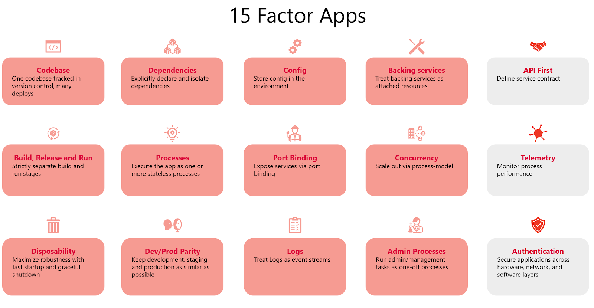

## 12 Factor App Principles: 15 Factor Principles for Cloud-Native Applications

### One codebase, one application →
One codebase tracked in Git, many deploys (use Git, GitHub/GitLab).
### API First →
Define API contracts first (OpenAPI/Swagger) before coding.
### Dependencies management →
Declare all dependencies explicitly (pom.xml/build.gradle).
### Config → 
Store config in environment variables (@Value, Spring Cloud Config).
### Backing Services → 
Treat external services (DB, Redis, Kafka, S3) as attached resources.
###  Build, Release, Run → 
Separate build (Maven/Gradle), release (Docker image), and run (K8s).
###  Processes → 
Execute the app as one or more stateless processes (spring-boot:run).
### Port Binding →
Export services via port (server.port, embedded Tomcat/Netty).
### Concurrency → 
Scale out by running multiple instances (Spring Boot + Kubernetes replicas).
### Disposability → 
Fast startup/shutdown (Spring Boot quick start and graceful shutdown, health checks).
### Environment (Dev/Prod) Parity → 
Keep dev, staging, and prod environments as similar as possible (Docker).
### Logs → 
Treat logs as event streams (Spring Boot logging, ship to ELK/CloudWatch).
### Admin Processes → 
Run admin tasks as one-off processes (spring-shell, Flyway migrations).
### Telemetry →
Add monitoring, metrics (Micrometer + Prometheus + Grafana).
### Security (Authentication)→
Implement security everywhere (Spring Security, OAuth2/JWT, HTTPS).

✅ In short: Spring Boot naturally aligns with the 12-Factor methodology, and with extra factors like Telemetry, 
Security, and API-First, you get the 15-Factor approach for cloud-native microservices.

