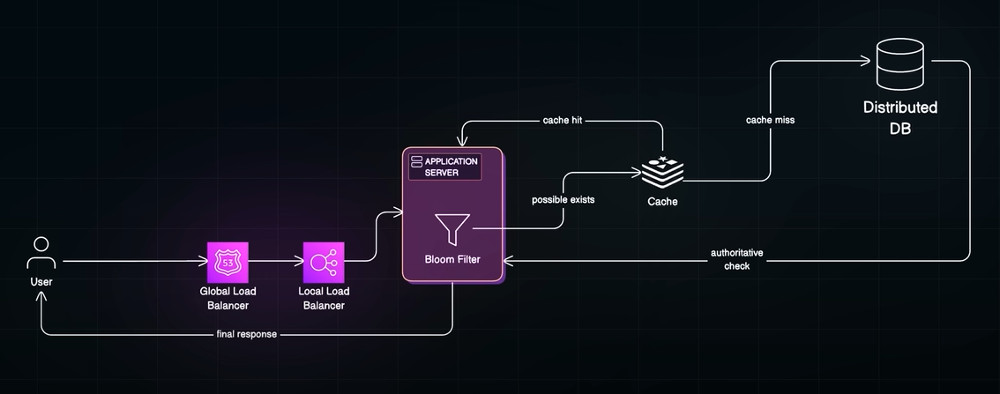

### ✅ Bloom Filter — Crisp Definition:

A **Bloom Filter** is a **probabilistic data structure** used to test whether an element is **possibly in a set or definitely not in a set**.
It provides very fast and memory-efficient membership checks, at the cost of allowing **false positives** (but never false negatives).

---

### ⚡ Key Characteristics:

| Property                 | Description                                              |
| ------------------------ | -------------------------------------------------------- |
| ✅ Space-efficient        | Uses bit array and hash functions                        |
| ✅ Fast                   | Constant time lookup and insert                          |
| ⚠️ False Positives       | May say "element exists" when it doesn’t                 |
| ❌ No False Negatives     | If it says "element does not exist", it’s always correct |
| ❌ Cannot Delete Elements | Unless using Counting Bloom Filter                       |

---

### ✅ How It Works:

1. Initialize a large bit array (all bits set to 0).
2. Use **k independent hash functions**.
3. To insert an element:

    * Apply k hash functions → get k bit positions → set bits to 1.
4. To check membership:

    * Apply k hash functions → check if all k bits are set to 1.
    * If yes → element is possibly in the set.
    * If no → element is definitely not in the set.

---

### ✅ Example Use Case:
* check user exist or not 
* Checking if a URL has been visited before in a web crawler.
* Filtering out non-existent users before DB lookup to save expensive calls.

---

