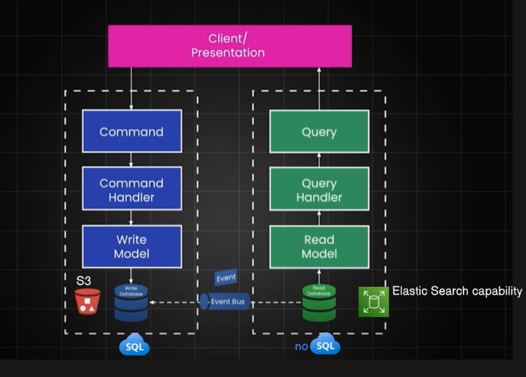

## **CQRS (Command Query Responsibility Segregation)**

CQRS is an architectural pattern that separates to write(create/delete/update) (Command) read (Query) operations into
different models instead of using the same data model for both.

**Why?:-**
In a typical CRUD service, the same database model handles both reads and writes.
As systems grow, read and write workloads have different performance and scalability.
CQRS splits them for independent scaling and optimization.

**How it works**
Command side → Handles create/update/delete (writes).
Query side → Handles reads (fetch data).
Both can use different databases optimized for their purpose.
**Example**
* E-commerce order service:
    * Command Service → Validates and creates new orders in a write-optimized DB (like PostgresSQL).
    * Query Service → Fetches order details from a read-optimized DB (like ElasticSearch,mongodb).

## Database Sync flow:

* Event-driven (most common) → async sync through messaging.
* Like User creates order:
    * POST /orders → Write microservice writes to Orders Write DB.
    * Publishes OrderCreatedEvent to Kafka.
    * Read microservice consumes OrderCreatedEvent and inserts a denormalized record into Orders Read DB.
    * Query calls (GET /orders/{id}) go to the Read DB.
### Disadvantage: -
* Client may experience stale (old) data

### Event Sourcing
Event Sourcing is a design pattern where state changes of a system are captured as a sequence of immutable events,
and the current state is derived by replaying these events in order.

