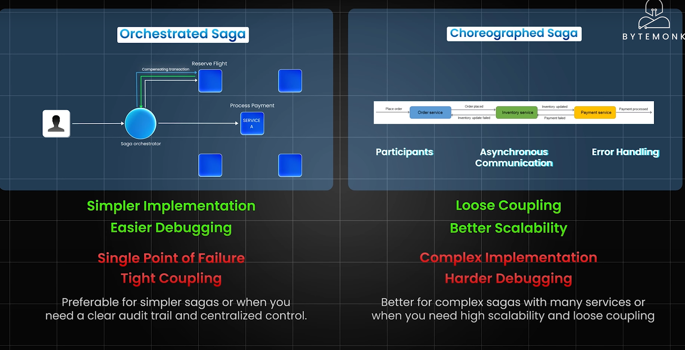

### Saga Pattern (Most popular)

**Two flavors:**

* **1. Choreography Saga (event-driven pattern)**
    * Each service publishes an event when it finishes work.
    * Other services listen and act on it.
    * If something fails, services publish compensating events to undo prior actions.

**Example (Order → Payment → Inventory):**

* Order Service: create order → publish OrderCreated
* Payment Service: reserve money → publish PaymentProcessed
* Inventory Service: reduce stock → publish StockReduced
* If inventory fails → publish InventoryFailed → Payment Service refunds money → Order Service cancels order.

* ✅ Pros: No central coordinator.
* ❌ Cons: Harder to track the flow.

* **2. Orchestration Saga (central coordinator)**

**One orchestrator service** tells each service what to do next.

Handles failures and compensations.

**Example:**

* Orchestrator: tell Order Service → "create order"
* Then tell Payment Service → "reserve money"
* Then tell Inventory Service → "reduce stock"
* If a step fails → orchestrator triggers compensations.

* ✅ Pros: Easier to manage flow.
* ❌ Cons: Orchestrator becomes central dependency.

