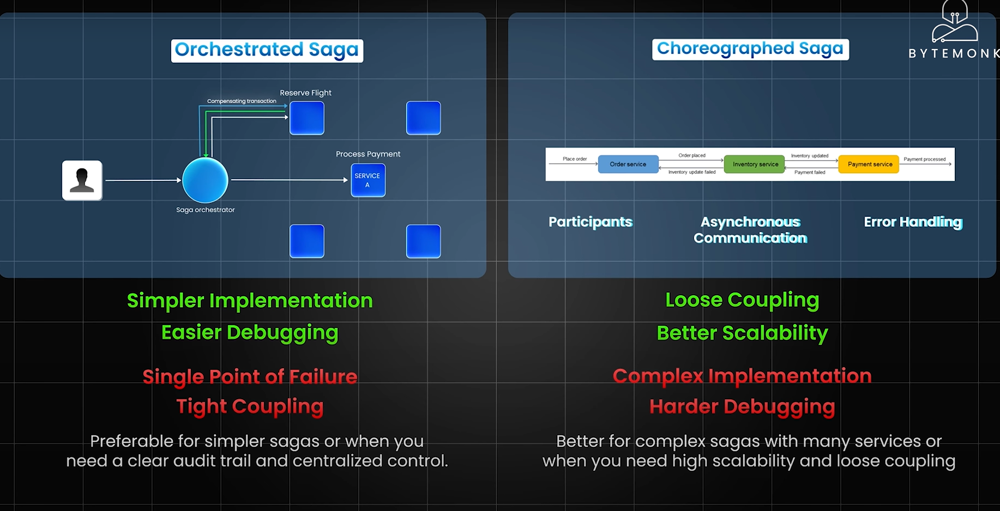
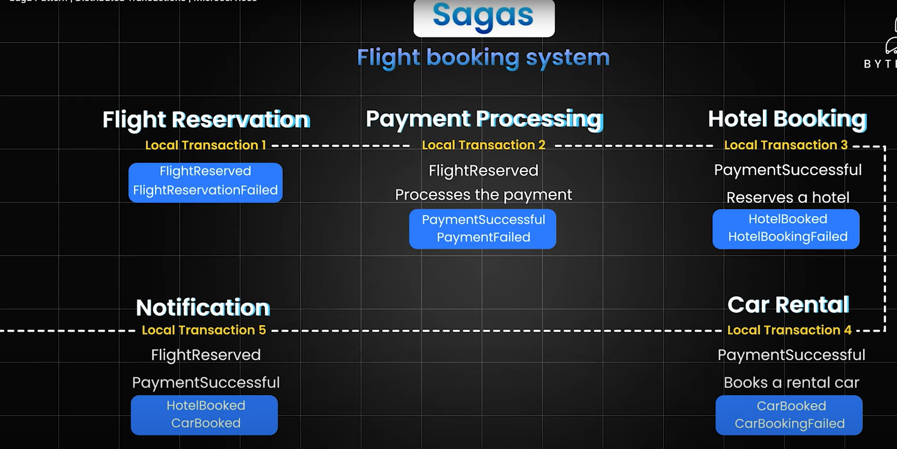
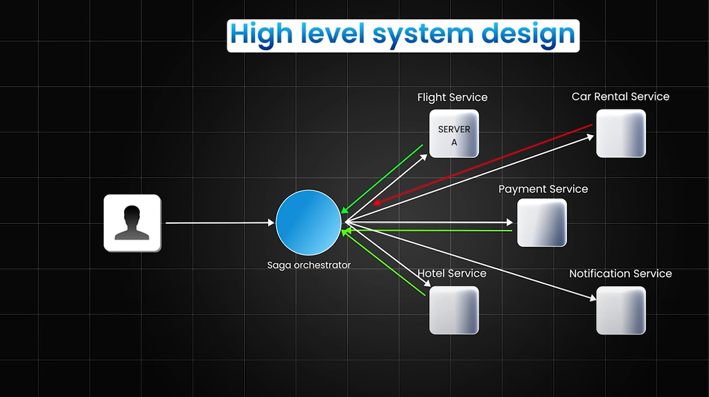

### Saga Pattern (Most popular)

**Two flavors:**

* **1. Choreography Saga (event-driven pattern)**
    * Each service publishes an event when it finishes work.
    * Other services listen and act on it.
    * If something fails, services publish compensating events to undo prior actions.

* ✅ Pros: No central coordinator.
* ❌ Cons: Harder to track the flow.

* **2. Orchestration Saga (central coordinator)**
* One orchestrator service** tells each service what to do next.
* Handles failures and compensations.

* ✅ Pros: Easier to manage flow.
* ❌ Cons: Orchestrator becomes central dependency.

Example 

