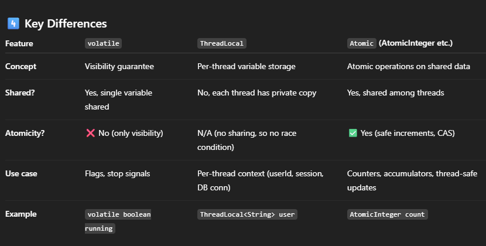
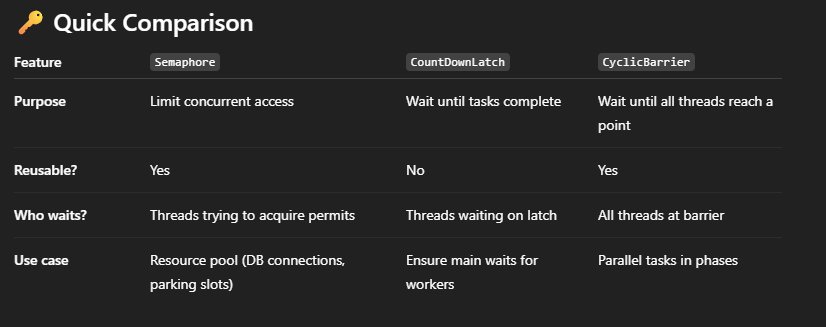

### Executor thread pools
-commonly used in Java, typically created using static factory methods in the Executors class:-

**1) FixedThreadPool:**
- Description: Creates an ExecutorService with a fixed number of threads. 
   The number of threads remains constant throughout the lifetime of the pool.
- Behavior: If more tasks are submitted than there are threads, the excess tasks are placed in an unbounded queue and wait 
   until a thread becomes available.
- Use Cases: Suitable for applications where you want to limit the maximum number of threads concurrently executing tasks
  to control resource consumption (e.g., in a server where you don't want to exhaust CPU or memory with too many threads).

**2) CachedThreadPool:**
- Description: Creates an ExecutorService that creates new threads as needed to handle incoming tasks.
  It reuses previously constructed threads when they are available.
- Behavior: If a thread remains idle for a certain period (default 60 seconds), 
  it is terminated and removed from the pool. This pool has no fixed size limit on the number of threads.
- Use Cases: Ideal for applications with many short-lived, asynchronous tasks.
  It can dynamically adjust the number of threads based on the workload, efficiently handling bursts of requests.
  However, it can create a very large number of threads if tasks arrive faster than they can be processed,
  potentially exhausting system resources.

**3) SingleThreadExecutor:**
- Description: Creates an ExecutorService that uses a single worker thread to execute tasks.
- Behavior: All tasks are executed sequentially in the order they are submitted.
  This guarantees that tasks will complete in submission order and that no two tasks will run concurrently.
- Use Cases: Useful when you need to ensure tasks are executed serially, for example,
  for event processing where order matters or for tasks that modify shared resources that are not thread-safe.

**4) ScheduledThreadPool:**
- Description: Creates an ExecutorService that can schedule tasks to run after a specified delay or at regular intervals.
  It uses a fixed number of threads for scheduled execution.
- Behavior: Provides methods like schedule(), scheduleAtFixedRate(), and scheduleWithFixedDelay() for timed task execution.
- Use Cases: Perfect for background tasks, recurring jobs, or delayed actions (e.g., sending reminder emails,
  periodically updating data, triggering alarms).

**5) WorkStealingPool (Introduced in Java 8):**
- Description: Creates a work-stealing thread pool with a target parallelism level. It's based on the ForkJoinPool.
- Behavior: Designed for applications with tasks that might generate other sub-tasks (like recursive algorithms).
  Threads that finish their own tasks can "steal" tasks from other busy threads, leading to better CPU utilization.
- Use Cases: Suited for highly parallel, divide-and-conquer style algorithms where tasks can be broken down into smaller,
  independent sub-tasks.

**6) VirtualThreadPerTaskExecutor (Introduced in Java 21)**
- What it does:
   - Creates a new virtual thread for each submitted task: Unlike traditional thread pools (like FixedThreadPool or 
     CachedThreadPool) that reuse a limited number of "platform threads" (OS-managed threads), newVirtualThreadPerTaskExecutor()
     creates a new virtual thread for every Runnable or Callable task you submit to it.
   - Leverages virtual threads: This is the key. Virtual threads are extremely lightweight threads managed by the 
     Java Virtual Machine (JVM), not directly by the operating system

### What are differences between submit() and execute() methods in ExecutorService?
-> submit() and execute().
Both methods execute tasks asynchronously using a thread pool managed by the ExecutorService. 
However, there are some differences between the two methods.

1) Return value: To submit() method returns a Future object that can be used to retrieve the result of the task 
execution or to cancel the task. and execute() method does not return anything.

2) Task type: To submit() method can accept tasks that implement either the Callable or Runnable interfaces, 
while the execute() method can only accept tasks that implement the Runnable interface.

3) Blocking behavior: To submit() method is a blocking call that waits for the task to complete and return its result
before returning. The execute() method is a non-blocking call that simply submits the task for execution and returns immediately.

### Difference between  newCachedThreadPool vs newFixedThreadPool
Both newCachedThreadPool and newFixedThreadPool are factory methods in the java.util.concurrent.Executors class 
that create thread pools. However, they differ in their behavior and use cases.

-> newCachedThreadPool() creates a thread pool that will automatically adjust its size based on the current workload.
It starts with zero threads and creates new threads as needed to handle incoming tasks.
If a thread remains idle for 60 seconds, it is terminated and removed from the pool.
This makes it ideal for scenarios where you have a large number of short-lived tasks and you want to optimize
the use of system resources.

-> newFixedThreadPool(int nThreads) creates a thread pool with a fixed number of threads.
Once all threads are in use, new tasks are queued until a thread becomes available.
This makes it ideal for scenarios where you have a fixed amount of resources to dedicate to task processing, 
such as when you are processing a large number of long-running tasks.

-> In summary, the newCachedThreadPool() is best suited for situations where you have a lot of short-lived tasks and 
want to optimize resource usage, while newFixedThreadPool(int nThreads) is better for scenarios
where you have a fixed amount of resources to process a large number of long-running tasks.

**=>CyclicBarrier vs countdown-latch difference**

*) Usage: CyclicBarrier is used to synchronize a group of threads at a specific point, where each thread waits for other
threads to reach the same point, and then all threads can proceed together. 
CountDownLatch is used to synchronize one or more threads by waiting for them to complete a set of tasks.

*) Constructor: CyclicBarrier takes two arguments: the number of threads that need to reach the barrier and a Runnable that is
    executed when all threads reach the barrier.
    CountDownLatch takes a single argument that represents the number of events that need to occur before the latch is released.
 
### what is implicit or explicit lock
- In Java, locks are mechanisms used to manage access to shared resources by multiple threads to prevent race conditions 
and ensure thread safety. Locks can be either explicit or implicit, and here's the difference:

Implicit Lock (or Monitor Lock)

* Definition: Implicit locks are those that are automatically acquired by the JVM when a thread enters a synchronized 
  block or method.
* Usage: When you use the synchronized keyword, the lock is implicitly acquired on the object used in the synchronization.
```java
public class SynchronizedLock{
public synchronized void someMethod() {
// Thread acquires lock on 'this' object (implicit lock)
// Critical section
}

//Or

public void someMethod() {
synchronized(this) {
// Thread acquires lock on 'this' object (implicit lock)
// Critical section
}
}
```
* Lock Release: The lock is automatically released when the synchronized block or method exits, 
  either normally or due to an exception.

**Explicit Lock**
* Definition: Explicit locks are those that the developer manually acquires and releases using the **Lock interface** 
  from the java.util.concurrent.locks package.
* Usage: You have more control over the locking mechanism, including the ability to try acquiring the lock without blocking 
  or with a timeout.

```java
import java.util.concurrent.locks.Lock;
import java.util.concurrent.locks.ReentrantLock;

public class SomeClass {
private final Lock lock = new ReentrantLock();

    public void someMethod() {
        lock.lock();  // Acquiring the lock explicitly
        try {
            // Critical section
        } finally {
            lock.unlock();  // Releasing the lock explicitly
        }
    }
}
```

* Flexibility: Explicit locks offer more flexible locking mechanisms compared to implicit locks, such as reentrant locking, 
  interruption locking, and the ability to attempt locking.

### Key Differences:
1. Control: Explicit locks give more control over locking, while implicit locks are managed by the JVM.
2. Reentrancy: Both synchronized (implicit locks) and ReentrantLock (explicit locks) are reentrant, 
   meaning a thread can acquire the same lock multiple times without deadlocking itself.
3. Timeouts: Explicit locks can be used with timeouts, whereas implicit locks cannot.

### Race condition 
- Occurs when two or more threads access shared data and try to change it at the same time. Since thread scheduling can
  lead to unpredictable thread execution order, the final outcome depends on the specific sequence of thread execution,
  which can lead to unexpected and incorrect behavior.

### Difference between concurrency and parallelism in a Java (and general computing) context:
* 1. Concurrency
  * Concurrency is about dealing with multiple tasks at the same time, but not necessarily executing them simultaneously.
    Tasks make progress in overlapping time periods, often by switching between them (context switching).
  * Managed by threads scheduled by the JVM/OS.
  * May run on a single CPU core by switching quickly between tasks.
  * Example ExecutorService can run multiple tasks concurrently even on one core.
* 2. Parallelism
    * Parallelism is about actually executing multiple tasks at the same instant.
    * Requires multiple CPU cores or processors.
    * Threads run truly simultaneously on different CPU cores.
    * Example Using ForkJoinPool or parallel streams (.parallelStream()),split the tasks and run in parallel threads on
      multiple cores.


  

## Difference Platform Thread (Traditional Java Thread) VS Virtual Thread (Java 19+ – Project Loom)

### Platform Thread (Traditional Java Thread)
* Definition: A platform thread is a wrapper around an OS thread.
* Operating System (OS) thread.
* Creation Cost: Expensive – creating too many leads to high memory + scheduling overhead.
* Blocking Behavior: If a platform thread blocks (e.g., on I/O, sleep(), or join()), its underlying OS thread is also blocked → wasted resource.
* Concurrency Model: Limited concurrency (can’t create thousands/millions easily).
* Use Cases:
  * Long-running CPU-bound tasks.
  * Situations where thread count is relatively small but predictable.

### Virtual Thread (Java 19+ – Project Loom)    
* Definition: A virtual thread is a lightweight thread managed by the JVM, not directly tied to an OS thread.
* Runs on top of **a small pool of carrier platform thread**s (like a thread scheduler).
* Creation Cost: Very cheap – you can create millions of virtual threads.
* Blocking Behavior: If a virtual thread blocks, the JVM simply unmounts it from the **carrier thread**, freeing the OS thread to run others.
* Concurrency Model: Massive concurrency (millions of concurrent tasks possible).
* Use Cases:
  * I/O-bound applications (network servers, DB calls, HTTP requests).
  * High-concurrency workloads (like handling 1M HTTP requests in parallel).
* Note:-👉 In short:
  * Platform threads = heavyweight, OS-backed.
  * Virtual threads = lightweight, JVM-scheduled, scalable.


### ThreadLocal in Java

* ThreadLocal provides thread-local variables, i.e., variables that are unique to each thread.
* Each thread accessing a ThreadLocal has its own isolated copy of the variable.
* No thread can see or modify another thread’s value.
* How it works
  * Internally, each Thread maintains a map (ThreadLocalMap) that holds values for its ThreadLocal variables.
  * When you call get() or set() on a ThreadLocal, it fetches/updates the value from the calling thread’s map.
* ✅ In short:
  ThreadLocal = thread-specific storage.
  Each thread gets its own copy of the variable, isolated from others.

  * Use Cases
     * Maintaining user/session context in web apps (e.g., storing request ID).
     * Holding database connection per thread in connection pools.
     * Preventing shared mutable state without synchronization.

  * Important Points
     * ThreadLocal helps avoid synchronization but does not replace proper design.
     * Always call remove() after use (especially in thread pools), otherwise memory leaks can happen because threads are reused.
```java
ThreadLocal.withInitial(()->0);
new ThreadLocal();
```
### ThreadLocal vs volatile
- are often confused, but they solve very different concurrency problems
  **1️⃣ volatile**
👉 Purpose: Ensures visibility of changes to a variable across multiple threads.
- Each thread normally has a local CPU cache. Without volatile, one thread’s update might not be visible to others immediately.
- volatile guarantees that read/write goes directly to main memory.
  **Key points:**
- One shared copy of the variable across all threads.
- No atomicity (only visibility). For compound operations (count++), you still need synchronization.
- Lightweight compared to synchronized.
  **2️⃣ ThreadLocal**
👉 Purpose: Provides thread-local storage, i.e., each thread has its own copy of a variable.
- Useful when you don’t want threads to share state.
- Value is isolated to each thread → no synchronization needed.
- Commonly used for things like request context, DB connections
  **3️⃣ Atomic Variables (Atomicity)**
- Purpose: Provide atomic (indivisible) operations on shared variables.
- Use classes like AtomicInteger, AtomicBoolean, AtomicReference.
- Guarantee visibility + atomicity (safe increments, compare-and-swap).
- 
  **✅ In short:**
- Use volatile for visibility of flags/single values.
- Use ThreadLocal for per-thread data isolation.
- Use Atomic for lock-free thread-safe updates on shared variables.
## Semaphore, CountDownLatch, CyclicBarrier are core concurrency utilities in Java, but they solve different problems
### 1️⃣ Semaphore
- Used to control access to a resource with a fixed number of permits (like limited parking slots).
- Methods acquire() and release  
- Example: 2 permits (2 threads can enter at a time)
```java
import java.util.concurrent.Semaphore;

public class SemaphoreExample {
    private static final Semaphore semaphore = new Semaphore(2); // 2 permits

    public static void main(String[] args) {
        for (int i = 1; i <= 5; i++) {
            int threadId = i;
            new Thread(() -> {
                try {
                    semaphore.acquire(); // get permit
                    System.out.println("Thread " + threadId + " acquired permit");
                    Thread.sleep(1000); // simulate work
                    System.out.println("Thread " + threadId + " releasing permit");
                    semaphore.release(); // release permit
                } catch (InterruptedException e) {
                    Thread.currentThread().interrupt();
                }
            }).start();
        }
    }
}

```
### 2️⃣ CountDownLatch
👉 Used to make one/more threads wait until a set of operations complete.
- Once count reaches 0, all waiting threads are released.
- Cannot be reused.
- Example: Wait for 3 workers to finish before proceeding
```java
import java.util.concurrent.CountDownLatch;

public class CountDownLatchExample {
    private static final CountDownLatch latch = new CountDownLatch(3);

    public static void main(String[] args) throws InterruptedException {
        // Worker threads
        for (int i = 1; i <= 3; i++) {
            int workerId = i;
            new Thread(() -> {
                try {
                    System.out.println("Worker " + workerId + " started work");
                    Thread.sleep(1000 * workerId);
                    System.out.println("Worker " + workerId + " finished");
                    latch.countDown(); // reduce latch
                } catch (InterruptedException e) {
                    Thread.currentThread().interrupt();
                }
            }).start();
        }

        // Main thread waits
        System.out.println("Main thread waiting...");
        latch.await(); // wait until count reaches 0
        System.out.println("All workers finished. Main thread continues...");
    }
}

```
###  3️⃣ CyclicBarrier
- Used to make threads wait for each other at a common barrier point before continuing.
- Reusable (barrier resets automatically).
```java
import java.util.concurrent.BrokenBarrierException;
import java.util.concurrent.CyclicBarrier;

public class CyclicBarrierExample {
    private static final CyclicBarrier barrier = new CyclicBarrier(3, 
        () -> System.out.println("All parties arrived at barrier, let's proceed!")
    );

    public static void main(String[] args) {
        for (int i = 1; i <= 3; i++) {
            int threadId = i;
            new Thread(() -> {
                try {
                    System.out.println("Thread " + threadId + " working...");
                    Thread.sleep(1000 * threadId);
                    System.out.println("Thread " + threadId + " waiting at barrier");
                    barrier.await(); // wait for others
                    System.out.println("Thread " + threadId + " passed barrier");
                } catch (InterruptedException | BrokenBarrierException e) {
                    Thread.currentThread().interrupt();
                }
            }).start();
        }
    }
}

```
