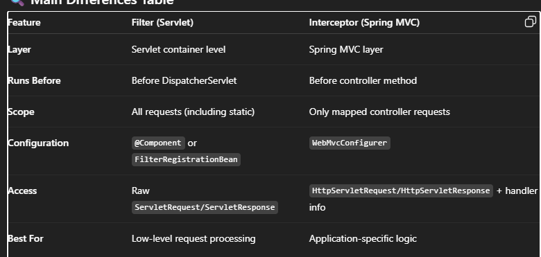

1). What is spring boot?
Ans). Spring boot is an extension of spring framework used to rapid application development.
      It has extra support of autoconfiguration, embedded application server like "tomcat" and "jetty" and "starter" etc.

*  Difference between Spring and Spring Boot ?
 Spring: Widely used for building enterprise Java applications.
Involves writing lots of boilerplate code.
Needs dependencies to be defined manually.
The most important feature of the Spring Framework is dependency injection.
Involves setting up server manually.
It helps to create a loosely coupled application.

Spring Boot : Widely used for building REST APIs it extension of spring boot.
Reduces boilerplate code.
Starters take care of dependencies.
The most important feature of the Spring Boot is Autoconfiguration.
Includes embedded server like Tomcat and Jetty.
It helps to create a stand-alone application.

2).What is Authentication and Authorisation?
 -> in server side Authentication checks user is valid or not(401 HTTP ERROR CODE)/(bad request) by credential. and 
    Authorisation checks user is authorized or not(403 HTTP ERROR CODE)/(forbidden) for particular resources.
 
3). How to secure your RestAPI?  
 -> There are a multiple way to secure restApi:-
   1) Basic Authentication (I used in my project)
   2) Oauth 2.0
   3) JWT (Most, common stateless and fast)


4) What is Actuator?
 -> Basically Actuator is used for Monitoring the health of our application.
like metrics,bean,health
 
6) What DI (Dependency Injection)?
-> Dependency Injection is injecting one bean to another bean for further process. there are three types:-
   1) Setter Injection
   2) Constructor Intention
   3) Field Injection 
   
7) What is IOC?
-> IOC stands for inversion of control is a design pattern it's an implementation of Dependency Injections.
   => OR == Spring IoC is the mechanism to achieve loose-coupling between Objects dependencies. 

Q). ORM tool?
Ans). Object-relational mapping:  used to access data from the database server. 

Q). Path variable vs Request param vs Request body...?
Ans). Path variable: It is used to extract values from the URL/URI path where value enclosed with "{}" braces.(@PathVariable)
      Request param: It is used to extract values from the query string.(@RequestParam)
      Request body: It is used to extract the entire request body from an incoming HTTP post request.(@RequestBody)
      
**Query-String:** 
=> Consists of one or more key-value pairs separated by an ampersand(&) symbol. The key is the name of the parameter,
and the value is the data being passed. 

**Diff between interceptor vs filter?**
Filters and Interceptors both allow you to run custom logic before and after a request is processed — but they work at 
different layers and have different purposes.

1️⃣ Filter
Where it works:
* Servlet level (part of Java EE specification).
* Runs before the request reaches the DispatcherServlet.
-> Use cases:
* Request/response logging
* Security checks
* GZIP compression
* CORS handling

2️⃣ Interceptor
Works Spring MVC level (inside DispatcherServlet).
Works on controller method calls.
Use cases:
Authentication & authorization
Modifying model data
Measuring request processing time
API versioning checks


## **What is CAP theorem**
(Eric Brewer’s theorem) says that in a distributed system, 
you can only guarantee two out of three properties at the same time:
### C – Consistency
Every read gets the latest write (all nodes see the same data at the same time).
Example: In a banking app, after you deposit ₹1000, all servers should immediately show the updated balance.

### A – Availability
Every request gets a response (even if it's not the most recent data).
Example: Even if one node is down, another node responds without error.

### P – Partition Tolerance
The system continues to operate despite network failures that split it into partitions.
Example: If some nodes can't talk to each other due to a network issue, the system still works.


Understanding CAP theorem helps architects and developers design systems based on specific requirements:
  * For banking or financial transactions, Consistency is often prioritized (CP).
  * For user-facing applications like social media, Availability is often prioritized (AP).

The CAP theorem emphasizes the importance of identifying trade-offs in distributed system design to meet business needs effectively.

## Circuit breaker ?````
Circuit breaker comes under fault tolerance. We can implement through resilience4j.
states of circuit breaker: closed, Open, half-Closed.

* Q:). Spring Bean scope ?
  scopes define the lifecycle and visibility of a bean — basically, how long the bean exists and who can use it.


Q). REQUEST methods for REST API?
1. GET
Purpose: Retrieve data from the server.
Safe (no data changes) and idempotent (same result every time).
2. POST
Purpose: Create a new resource.
Not idempotent (multiple calls create multiple resources).
3. PUT
Purpose: Update entire resource (replace all fields).
Idempotent (same request → same result).

4. PATCH
Purpose: Update partial resource (only specific fields).
Not necessarily idempotent.

5. DELETE
Purpose: Remove a resource.
Idempotent (deleting twice is the same as deleting once).


## JPA ?
Ans). The Java Persistence API (JPA) is the specification of Java that is used to persist data between a Java object and
relational database. JPA acts as a bridge between object-oriented domain models and relational database systems.

## What are @RequestParam, @RequestBody, @PathVariable ?
@RequestParam: Is used to extract the fixed value from the query string.
@RequestBody: Is used to extract the entire request body from an incoming HTTP POST.
@PathVariable: Is used to extract dynamic values from the URI/URL path.
